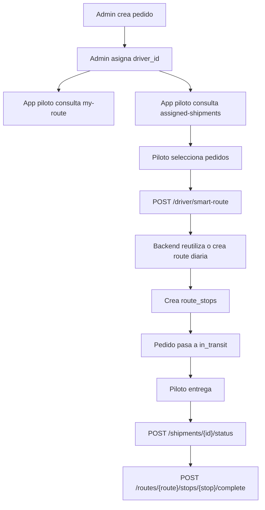

# Arquitectura maestra - rutas, piloto y mapa

Fecha: 2026-06-30  
Repos relacionados:
- `P16-DHE-Admin-Web`
- `P15-DHE-App-Repartidor`

## Objetivo

Documentar con claridad:

1. Como funciona hoy el sistema de rutas entre panel admin, backend y app piloto.
2. Por que aparecen estados hibridos como "paquete asignado" + "sin ruta activa".
3. Cual es la arquitectura objetivo recomendada.
4. Como migrar hacia ella sin romper produccion.

## Resumen ejecutivo

El sistema actual usa la entidad `route` para demasiadas responsabilidades al mismo tiempo:

- jornada operativa del piloto en el dia,
- contenedor de paradas,
- estado de ejecucion del piloto,
- fuente de verdad para el mapa,
- agregado de progreso y entregas del dia.

Eso funciona mientras el flujo es lineal, pero genera friccion cuando:

- se asignan paquetes despues de cerrar la ruta del dia,
- hay paquetes asignados al piloto pero aun no enroutados,
- la ruta existe pero no tiene paradas pendientes,
- la app necesita distinguir entre "jornada del dia", "mapa navegable" y "pedidos disponibles".

La recomendacion central es separar conceptualmente:

- asignacion del pedido al piloto,
- jornada operativa del dia,
- secuencia navegable de paradas,
- estado de mapa para la app.

## Estado actual de implementacion (2026-07-01)

Ya quedaron implementadas dos piezas de estabilizacion que este documento proponia:

- `GET /api/driver/operational-state` como contrato unificado de lectura para la app piloto;
- `POST /api/driver/location` para ping de ubicacion viva del piloto;
- consumo del contrato unificado desde la app piloto con fallback legacy;
- tarjeta base de monitoreo en el panel administrativo para ver piloto, paradas y frescura de ubicacion.

Esto reduce la ambiguedad original, pero todavia no reemplaza el backlog restante de:

- persistencia rica de optimizacion;
- geometria vial real;
- QA final en build nativa;
- auditoria automatica de consistencia operativa.

## Arquitectura actual

### Entidades reales

#### `shipments`

Representa el pedido operativo.

Campos con rol importante:

- `driver_id`: piloto responsable del pedido.
- `status`: estado logistico del pedido.
- `payment_type`, `financial_status`: flujo financiero.

#### `routes`

Representa hoy una mezcla de:

- jornada del piloto,
- ruta activa del mapa,
- acumulador de progreso del dia.

Campos clave:

- `driver_id`
- `route_date`
- `status` (`planned`, `active`, `completed`)
- `total_stops`
- `completed_stops`

Restriccion relevante:

```text
unique(driver_id, route_date)
```

Esa restriccion impone un solo contenedor de ruta por piloto por dia.

#### `route_stops`

Representa la inclusion real de un pedido dentro de una ruta secuenciada.

Campos clave:

- `route_id`
- `shipment_id`
- `sort_order`
- `status` (`pending`, `completed`, `skipped`)

## Flujo actual real

### Flujo operativo

1. Admin crea pedido.
2. Admin asigna `driver_id` al pedido.
3. La app del piloto consulta siempre:
   - `GET /api/driver/my-route`
   - `GET /api/driver/assigned-shipments`
4. Si hay pedidos asignados sin `route_stops`, la app los muestra como "paquetes sin enrutar".
5. Cuando el piloto toca "Agregar a mi ruta" o "Crear ruta inteligente", la app envia `POST /api/driver/smart-route`.
6. El backend:
   - valida que los pedidos sean del piloto,
   - intenta reutilizar una ruta del dia,
   - crea `route_stops`,
   - pasa pedidos a `in_transit`,
   - optimiza orden si hay coordenadas.
7. Al entregar:
   - la app marca el pedido como `delivered`,
   - luego completa la parada en la ruta.

### Diagrama del flujo actual



## Problema estructural

La app necesita responder cuatro preguntas distintas:

1. El piloto tiene pedidos asignados?
2. El piloto tiene una jornada abierta hoy?
3. El piloto tiene una ruta navegable con paradas?
4. El piloto ya cerro la jornada pero recibio mas pedidos?

Hoy esas cuatro preguntas se resuelven indirectamente con solo dos recursos:

- `route`
- `assignedShipments`

Eso crea estados ambiguos.

## Estados hibridos que hoy aparecen

### Caso 1: pedido asignado pero sin ruta

- `shipments.driver_id = piloto`
- no existe `route_stop`
- `my-route = null`
- `assigned-shipments > 0`

La app muestra:

- banner de paquetes asignados,
- pero mapa sin ruta.

Eso no es un bug aislado: es una consecuencia natural del modelo actual.

### Caso 2: ruta del dia completada y llega un pedido nuevo

- existe `routes(driver_id, route_date)` con `status = completed`
- llega un nuevo pedido para el mismo piloto y mismo dia
- `assigned-shipments > 0`
- `my-route` no la devuelve porque solo toma `planned` o `active`
- `smart-route` historicamente intentaba crear otra fila y chocaba con `unique(driver_id, route_date)`

Este fue el bug que acabamos de corregir reabriendo la ruta del dia.

### Caso 3: ruta existe pero sin paradas pendientes

- `route` existe
- `route.stops` completadas o vacias
- el dashboard puede seguir mostrando "Ruta Programada"
- el mapa interpreta `orderedStops.length === 0` como "Sin ruta activa"

La entidad existe, pero para la experiencia de mapa ya no es navegable.

## Diagnostico de arquitectura

La entidad `route` esta sobrecargada.

Hoy cumple simultaneamente estas responsabilidades:

1. contenedor diario del piloto,
2. secuencia de navegacion,
3. resumen de progreso,
4. historial de trabajo del dia,
5. punto de integracion para la app.

Cuando una sola entidad hace demasiadas cosas, los bugs aparecen como contradicciones de estado, no como errores de una sola linea.

## Arquitectura objetivo recomendada

### Principio rector

Separar:

- responsabilidad del pedido,
- jornada operativa,
- ruta navegable,
- estado visual de la app.

### Modelo objetivo

#### Nivel 1 - Asignacion

`shipment.driver_id`

Responde:

- quien es responsable del pedido.

No significa automaticamente que ya este dentro de una ruta navegable.

#### Nivel 2 - Jornada operativa

`route`

Debe representar:

- la jornada operativa del piloto para una fecha.

No debe usarse sola para inferir si hay mapa listo.

#### Nivel 3 - Secuencia navegable

`route_stops`

Debe representar:

- los pedidos efectivamente incorporados al recorrido,
- el orden real de atencion,
- que esta pendiente y que ya fue completado.

#### Nivel 4 - Estado derivado para la app

Un recurso de lectura para movil que responda explicitamente:

- `has_route_day`
- `has_navigable_stops`
- `has_assigned_shipments`
- `route_status`
- `pending_assigned_count`

## Contrato objetivo para movil

En vez de depender de deducciones implcitas, la app deberia leer algo asi:

```ts
type DriverOperationalState = {
  route_day: null | {
    id: number;
    date: string;
    status: "planned" | "active" | "completed";
    total_stops: number;
    completed_stops: number;
  };
  navigable_route: null | {
    id: number;
    status: "planned" | "active";
    stops: RouteStop[];
  };
  assigned_shipments: Shipment[];
  flags: {
    has_route_day: boolean;
    has_navigable_stops: boolean;
    has_assigned_shipments: boolean;
    can_create_or_extend_route: boolean;
    can_resume_completed_day: boolean;
  };
}
```

Con ese contrato, la app deja de adivinar.

## Dos opciones de evolucion

### Opcion A - Mantener una sola ruta por piloto por dia

Ventajas:

- menor cambio estructural,
- compatible con lo que ya existe,
- mas facil de desplegar sin migraciones profundas.

Reglas:

- `route` sigue siendo unica por `driver_id + route_date`,
- si la jornada estaba completada y llega trabajo nuevo, se reabre,
- la app usa banderas explicitas para distinguir "ruta del dia" vs "mapa navegable".

Esta opcion es la mas realista a corto plazo.

### Opcion B - Multiples rutas por piloto por dia

Ventajas:

- separacion mas limpia entre bloques de trabajo,
- mejor historial por tanda o corte operativo.

Desventajas:

- rompe supuestos actuales,
- obliga a redefinir `my-route`,
- requiere quitar o rediseñar `unique(driver_id, route_date)`,
- aumenta complejidad en panel, reportes y app.

No la recomiendo como siguiente paso inmediato.

## Recomendacion concreta

Adoptar **Opcion A** y hacer explicita la semantica.

Es decir:

1. Mantener una jornada unica por piloto por dia.
2. Permitir reabrir esa jornada si entra trabajo nuevo.
3. Separar a nivel de API:
   - pedidos asignados,
   - jornada del dia,
   - paradas navegables.
4. Dejar que la UI muestre estados distintos sin forzar todo dentro de "hay ruta" o "no hay ruta".

## Plan de migracion recomendado

### Fase 1 - Claridad de lectura

Sin tocar schema:

- agregar endpoint consolidado para estado operativo del piloto,
- exponer banderas de negocio,
- dejar de inferir todo desde `route?.stops.length`.

Objetivo:

- eliminar estados visuales ambiguos.

### Fase 2 - Reglas operativas explicitas

- formalizar reanudacion de jornada del dia,
- dejar auditado cuando una ruta completada se reabre,
- diferenciar en mensajes UI:
  - "tienes pedidos asignados"
  - "tu jornada esta cerrada"
  - "tu jornada fue reabierta con nuevos pedidos"

Objetivo:

- que la reapertura no parezca un comportamiento extrano.

### Fase 3 - Limpieza de contadores y consistencia

- recalcular sistematicamente `total_stops` y `completed_stops`,
- agregar verificaciones operativas periodicas,
- detectar rutas vacias, stops huerfanos y pedidos asignados sin visibilidad.

Objetivo:

- evitar divergencia entre contadores y datos reales.

### Fase 4 - UX alineada al dominio

Actualizar la app para mostrar tres bloques distintos:

1. jornada de hoy,
2. paradas activas,
3. paquetes asignados sin enrutar.

Objetivo:

- que el usuario entienda lo que esta pasando sin necesidad de interpretar mensajes tecnicos.

## Riesgos actuales si no se ajusta la arquitectura

- seguiran apareciendo estados mixtos entre dashboard, pedidos y mapa,
- cada nuevo fix sera local pero no resolvera la ambiguedad del modelo,
- el equipo puede confundir "pedido asignado" con "pedido en ruta",
- la operacion puede percibir errores donde en realidad hay transiciones no explicitadas.

## Decisiones recomendadas

### Decision 1

Definir oficialmente que `route` es una jornada diaria mutable, no una ruta inmutable.

### Decision 2

Definir que `assigned_shipments` y `route_stops` son dos estados distintos del pedido:

- asignado al piloto,
- incorporado a la ruta.

### Decision 3

Agregar un contrato operativo de lectura para movil y dejar de depender de inferencias UI.

## Conclusion

El problema no era solo "se crea una ruta". El problema de fondo es que hoy una misma `route` significa demasiadas cosas al mismo tiempo.

La arquitectura puede estabilizarse sin rehacerse desde cero si asumimos explicitamente este modelo:

- una jornada unica por piloto por dia,
- reutilizable y reabrible,
- con pedidos asignados fuera de ruta como bandeja separada,
- y con un contrato API que exprese claramente que parte del trabajo esta asignada, que parte esta enroutada y que parte esta navegable.

Ese es el punto de equilibrio mas sano entre negocio, operacion y costo de cambio.
