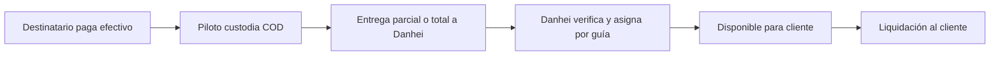
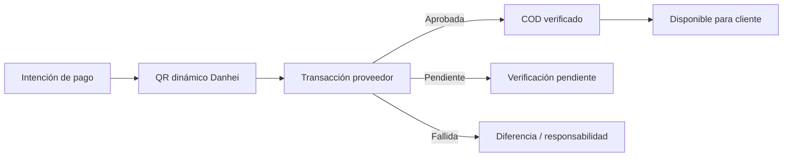

# Plan maestro de implementación — Ecosistema operativo y financiero Danhei Express

**Versión:** 1.1  
**Fecha:** 11 de julio de 2026  
**Estado:** En ejecución incremental — Fases 1 a 3 cerradas; flujo piloto de Fase 4 implementado  
**Repositorios involucrados:** P14 Cliente, P15 Piloto y P16 Admin/API  
**Documento rector:** este plan consolida el informe maestro, las especificaciones de P15/P16, la auditoría del código actual y las decisiones operativas acordadas.

---

## 1. Resumen ejecutivo

Danhei debe evolucionar de un sistema centrado en un único `shipment/pedido` a una plataforma que separe explícitamente:

1. solicitud de recogida;
2. tarea operativa;
3. recepción física de paquetes;
4. guía individual;
5. ruta y parada;
6. intento de entrega;
7. evidencia;
8. cadena de custodia;
9. cargos del cliente;
10. recaudo contraentrega;
11. conciliación del piloto;
12. liquidación al cliente;
13. cierre logístico y financiero.

La implementación será incremental, pero el entorno está en pruebas y se autoriza eliminar la información operativa de paquetes, pedidos, rutas, recaudos y conciliaciones. Se deben conservar usuarios, clientes, pilotos, direcciones, roles, permisos, zonas, tarifas y configuración administrativa.

WhatsApp queda aislado y fuera de la ruta crítica. El sistema funcionará completamente desde P14, P15 y P16 sin depender de Meta. La integración existente se conservará detrás de banderas de funcionalidad para retomarla posteriormente.

La conciliación financiera tendrá tres flujos independientes:

- destinatario → piloto, cuando el COD se recibe en efectivo;
- piloto → Danhei, para entregar y conciliar el efectivo;
- Danhei → cliente, para liquidar el COD disponible;
- adicionalmente, Danhei → piloto, como pago por servicios realizados.

El dinero que el piloto debe entregar y el dinero que Danhei debe pagarle nunca se compensarán silenciosamente. Cualquier cruce será explícito, autorizado y representado por dos movimientos contables.

Los pagos digitales por Nequi se diseñarán para llegar directamente a la cuenta empresarial de Danhei mediante QR dinámico. La verificación automática será preferida, pero no bloqueará de manera absoluta la entrega: el piloto podrá confirmar bajo su responsabilidad, dejando el pago pendiente de verificación y trasladando cualquier diferencia a su conciliación.

---

## 2. Objetivos

### 2.1 Objetivo principal

Construir un núcleo operativo y financiero robusto, auditable y desacoplado de canales externos, capaz de controlar el ciclo completo de cada paquete desde la solicitud de recogida hasta el cierre logístico y financiero.

### 2.2 Objetivos específicos

- Permitir solicitudes desde P14 y creación manual desde P16.
- Permitir recogida en la ubicación del cliente, entrega planificada en sede e ingreso espontáneo sin solicitud previa.
- Manejar una solicitud con uno o varios paquetes esperados.
- Registrar lo realmente recibido sin sobrescribir lo solicitado.
- Generar una guía individual por paquete aceptado físicamente.
- Representar recogidas, entregas, devoluciones y transferencias como tareas operativas.
- Permitir rutas mixtas y tareas pendientes sin ruta.
- Registrar cada intento de entrega con causal, GPS y evidencia.
- Mantener una cadena de custodia completa.
- Separar logística, cobros, recaudos, remuneración y liquidación.
- Conciliar pilotos por paquete, selección, ruta, día o saldo histórico.
- Liquidar clientes por guías verificadas y disponibles.
- Recibir pagos digitales directamente en Danhei.
- Trabajar de manera tolerante a fallos y, donde aplique, sin conexión.
- Auditar toda decisión sensible.
- Conservar compatibilidad con usuarios, clientes, pilotos y configuración actual.

### 2.3 Fuera del alcance inmediato

- Activación productiva de WhatsApp/Meta.
- Facturación electrónica completa.
- Nómina legal o tributaria de pilotos.
- Optimización avanzada con inteligencia artificial.
- Integración productiva de Nequi sin credenciales comerciales aprobadas.

Estos puntos no deben bloquear el núcleo operativo.

---

## 3. Decisiones ya tomadas

1. Se conservarán usuarios, clientes, pilotos y configuración.
2. Se puede eliminar toda la información operativa de prueba.
3. WhatsApp será un adaptador opcional y permanecerá desactivado.
4. P14 y P16 serán los canales iniciales para crear recogidas.
5. No se crearán guías definitivas como sustituto de una solicitud de recogida.
6. Una guía representa un paquete individual.
7. Los conceptos logísticos y financieros tendrán estados separados.
8. La conciliación del piloto tendrá dos cuentas independientes:
   - piloto debe a Danhei por COD;
   - Danhei debe al piloto por servicios.
9. La conciliación será atómica por guía, aunque se agrupe por día o ruta.
10. Los pagos parciales se asignarán a guías o conceptos específicos.
11. Nequi enviará el dinero digital directamente a Danhei.
12. El piloto podrá confirmar una entrega con pago pendiente de verificación bajo su responsabilidad.
13. Una captura o comprobante visual no será evidencia bancaria definitiva.
14. La entrega logística podrá terminar antes que el cierre financiero.
15. La entrada física de paquetes tendrá dos modalidades principales: recogida en la ubicación del cliente y entrega directa en una sede de Danhei.
16. Una persona podrá entregar paquetes en una sede sin solicitud previa; el personal autorizado creará el ingreso operativo en ese momento.
17. Una recogida en la ubicación del cliente podrá ejecutarla un piloto Danhei u otro recolector autorizado, siempre con identidad, asignación y custodia registradas.

---

## 4. Línea base confirmada del sistema actual

### 4.1 P16 API

El backend actual usa Laravel y ya contiene:

- usuarios, roles y permisos;
- clientes y direcciones;
- pilotos;
- `shipments`, `shipment_events`, `routes` y `route_stops`;
- solicitudes de recogida y paquetes de recogida;
- estados de envíos centralizados parcialmente;
- campos COD en `shipments`;
- conciliaciones COD agregadas por piloto y fecha;
- auditoría parcial;
- integración de WhatsApp considerable pero no activada productivamente.

### 4.2 P16 Admin

Ya existen páginas para:

- tablero;
- pedidos;
- recogidas, actualmente orientadas a WhatsApp;
- rutas;
- novedades;
- clientes;
- pilotos;
- pagos y COD;
- auditoría.

### 4.3 P15 Piloto

La aplicación Expo ya permite:

- autenticación;
- ver ruta y paradas;
- ubicación en primer y segundo plano;
- confirmar entregas;
- registrar novedades;
- capturar o seleccionar evidencia;
- reportar COD y método de pago;
- mostrar recaudo de ruta.

No tiene todavía tareas generales de recogida, devolución o transferencia, ni cola operativa offline completa.

### 4.4 P14 Cliente

El portal permite crear directamente un `shipment`, consultar envíos, finanzas y perfil. Debe modificarse para crear solicitudes de recogida y dejar de saltarse ese paso.

### 4.5 Brechas estructurales

- `route_stops` solo representa envíos.
- No existe `operational_tasks`.
- No existe lote físico de recogida.
- No existe intento de entrega independiente.
- La evidencia vive como campos simples en `shipments`.
- No existe cadena de custodia formal.
- No existen cargos inmutables y ajustables.
- La conciliación COD actual no asigna pagos a guías.
- No existe libro mayor del cliente.
- No existe liquidación de COD al cliente por guía.
- Nequi es solo un nombre de método reportado por el piloto.
- Algunas transiciones todavía actualizan estados directamente.

---

## 5. Arquitectura objetivo

```mermaid
flowchart LR
    P14["P14 Cliente"] --> CHOICE{"Modalidad de ingreso"}
    P16["P16 Admin"] --> PR["Servicio de solicitudes"]
    WA["WhatsApp desactivado"] -. "Adaptador futuro" .-> PR
    CHOICE -->|"Recogida en dirección"| PR
    CHOICE -->|"Entrega en sede anunciada"| PR
    WALK["Cliente o delegado llega sin solicitud"] --> INTAKE["Ingreso rápido en sede"]
    PR --> MODE{"Modo de cumplimiento"}
    MODE -->|"Recogida externa"| PICK["Tarea de recogida"]
    MODE -->|"Entrega directa"| INTAKE
    PICK --> EXEC["Piloto o recolector autorizado"]
    EXEC --> BATCH["Lote físico recibido"]
    INTAKE --> BATCH
    BATCH --> HUB["Custodia en sede Danhei"]
    BATCH --> SH["Guías"]
    SH --> TASK["Tareas operativas"]
    TASK --> ROUTE["Rutas y paradas"]
    ROUTE --> P15
    P15 --> ATT["Intentos de entrega"]
    ATT --> EV["Evidencias"]
    SH --> CU["Custodia"]
    ATT --> COD["Recaudo COD"]
    COD --> DREC["Conciliación piloto"]
    COD --> CLED["Cuenta del cliente"]
    CLED --> SET["Liquidación al cliente"]
    TASK --> EARN["Remuneración piloto"]
    EARN --> DREC
    ATT --> CHG["Cargos"]
    CHG --> CLED
    PAY["Nequi / proveedor de pago"] --> COD
```



### 5.1 Capas

- **Canales:** P14, P15, P16, WhatsApp futuro.
- **Aplicación:** casos de uso y autorización.
- **Dominio:** estados, transiciones, reglas e invariantes.
- **Persistencia:** modelos, migraciones y repositorios.
- **Integraciones:** geocodificación, almacenamiento, Nequi y WhatsApp.
- **Observabilidad:** auditoría, métricas, logs y alertas.

### 5.2 Regla de desacoplamiento

Ningún controlador, pantalla o integración externa debe modificar directamente estados financieros o logísticos críticos. Todo cambio debe pasar por un caso de uso o servicio de dominio.

---

## 6. Modelo operativo objetivo

### 6.1 Solicitud de recogida

Representa la intención del cliente, no la recepción física.

Orígenes:

```text
CLIENT_APP
ADMIN
WALK_IN_HUB
WHATSAPP
API_PARTNER
```

El canal de creación y la modalidad física son dimensiones distintas. Una solicitud creada en P14 o P16 puede terminar en recogida externa o entrega directa en sede.

Modalidades de ingreso:

```text
PICKUP_AT_CLIENT_LOCATION
PLANNED_DROPOFF_AT_DANHEI_HUB
WALK_IN_DROPOFF_AT_DANHEI_HUB
```

Ejecutores o participantes posibles:

```text
DANHEI_DRIVER
DANHEI_AUTHORIZED_COLLECTOR
AUTHORIZED_CONTRACTOR
CLIENT
CLIENT_DELEGATE
HUB_STAFF
```

Estados:

```text
DRAFT
SUBMITTED
VALIDATING
PENDING_REVIEW
NEEDS_CUSTOMER_INPUT
CONFIRMED
READY_FOR_ASSIGNMENT
ASSIGNED
EN_ROUTE
ARRIVED
PARTIALLY_COMPLETED
COMPLETED
FAILED
REJECTED
CANCELLED
```

Reglas:

- Una solicitud contiene uno o varios ítems esperados.
- `expected_quantity` nunca se reemplaza con la cantidad recibida.
- La aprobación administrativa no equivale a recepción.
- Cancelaciones y rechazos exigen causal.
- Toda reasignación conserva historial.
- La solicitud debe registrar por separado `source_channel` e `intake_mode`.
- Solo `PICKUP_AT_CLIENT_LOCATION` genera obligatoriamente una tarea externa de recogida.
- Una entrega anunciada en sede puede reservar horario, sede y cantidad estimada sin crear ruta.
- Una entrega sin solicitud previa crea, en una sola operación transaccional, la solicitud de origen `WALK_IN_HUB`, el ingreso físico y su primer evento de custodia.
- El flujo sin solicitud previa puede iniciar directamente en `ARRIVED/IN_PROGRESS`; el salto de estados debe quedar registrado con causal `WALK_IN_INTAKE`.
- Cuando no existía cantidad esperada, esta queda nullable o marcada como `NOT_PREDECLARED`; la cantidad física recibida nunca se inventa como una estimación histórica.
- El recolector debe ser un piloto registrado o una persona autorizada identificable. No se permiten asignaciones a texto libre sin trazabilidad.

### 6.1.1 Recogida en la ubicación del cliente

1. El cliente o administrador crea la solicitud.
2. Danhei valida dirección, cobertura, ventana, cantidad y condiciones.
3. Se crea una tarea `PICKUP`.
4. Se asigna un piloto o recolector autorizado.
5. El ejecutor registra salida, llegada, GPS e identidad.
6. Se comparan paquetes esperados y entregados.
7. El cliente confirma el lote.
8. Se registra custodia `CLIENT_TO_DRIVER` o `CLIENT_TO_AUTHORIZED_COLLECTOR`.
9. Al llegar a sede se registra transferencia hacia el personal/hub.

Si el recolector autorizado no usa P15, P16 deberá ofrecer un flujo restringido para registrar llegada, recepción y entrega en sede, con los mismos controles y auditoría.

### 6.1.2 Entrega planificada en sede Danhei

1. El cliente selecciona “Llevaré los paquetes a una sede”.
2. Elige sede, fecha o franja disponible.
3. Registra cantidad estimada y datos preliminares opcionales.
4. El sistema genera código o referencia de ingreso.
5. El cliente o delegado se presenta en la sede.
6. Personal Danhei localiza la solicitud, valida identidad y recibe físicamente.
7. Se crea el lote, comprobante y custodia `CLIENT_TO_HUB` o `CLIENT_DELEGATE_TO_HUB`.

Este flujo no crea recorrido de recogida ni pago a piloto por recogida, salvo una regla comercial posterior.

### 6.1.3 Entrega espontánea en sede sin solicitud

1. Cliente o delegado llega con uno o varios paquetes.
2. El personal busca al cliente por NIT, documento, teléfono o código interno.
3. Si el cliente no existe, se aplica la política de alta rápida o se remite a administración; no se crearán clientes duplicados sin validación.
4. P16 abre “Ingreso rápido en sede”.
5. Registra sede, persona que entrega, paquetes físicos, servicios, COD y observaciones.
6. El backend crea la solicitud `WALK_IN_HUB` y el lote en una transacción.
7. Cada paquete aceptado activa o reserva su guía según la política vigente.
8. Se registra custodia inmediata del hub y se genera comprobante.

La falta de solicitud previa no elimina controles de cobertura, datos mínimos, tarifas, restricciones de mercancía, COD ni auditoría.

### 6.2 Tarea operativa

Tipos:

```text
PICKUP
DELIVERY
RETURN
TRANSFER
HUB_INTAKE
```

Estados:

```text
PENDING_ASSIGNMENT
ASSIGNED
ACCEPTED
EN_ROUTE
ARRIVED
IN_PROGRESS
COMPLETED
FAILED
CANCELLED
```

Reglas:

- Una tarea puede estar asignada sin pertenecer todavía a una ruta.
- Solo puede existir una tarea activa equivalente para el mismo objeto y propósito.
- Las tareas pueden reprogramarse sin perder el intento anterior.
- El piloto no puede cambiar tarifas ni saldos desde una tarea.

### 6.3 Lote de recogida

El lote registra la visita física y el resultado real.

Debe conservar:

- solicitud origen;
- piloto;
- tarea;
- llegada y salida;
- GPS y precisión;
- paquetes esperados;
- recibidos;
- faltantes;
- rechazados;
- confirmación del cliente;
- evidencia;
- observaciones.
- modalidad de ingreso;
- sede de recepción, cuando aplique;
- tipo e identidad del ejecutor/recolector;
- persona que entrega físicamente en sede;
- empleado que recibe;
- referencia de ingreso o turno.

Cada ítem recibido puede:

- aceptar datos esperados;
- corregir datos operativos con auditoría;
- ser rechazado con causal;
- activar una guía individual.

### 6.4 Guía o envío

La guía es el registro individual del paquete aceptado.

Estados canónicos:

```text
CREATED
AWAITING_PICKUP
PICKED_UP
AT_HUB
ASSIGNED_FOR_DELIVERY
IN_TRANSIT
DELIVERED
DELIVERY_FAILED
REFUSED_BY_RECIPIENT
ISSUE
RESCHEDULED
RETURN_PENDING
RETURNING
RETURNED
CANCELLED
CLOSED
```

Compatibilidad:

- Se mantendrá un mapa explícito entre estados actuales y nuevos.
- Durante la transición, el API puede exponer estado canónico y estado heredado.
- Después de limpiar datos operativos y migrar consumidores, se retirarán alias obsoletos.

### 6.5 Reserva y activación de guía

Para permitir etiquetas previas sin confundir existencia con custodia:

- se podrá reservar un número de guía para un ítem esperado;
- la guía operativa se activa cuando el paquete es aceptado físicamente;
- un número reservado no implica `PICKED_UP`;
- un paquete no pasa a `PICKED_UP` sin evento de custodia.

### 6.6 Rutas y paradas

Estados de ruta:

```text
OPEN
IN_PROGRESS
COMPLETED
CLOSED
CANCELLED
```

Estados de parada:

```text
PENDING
ARRIVED
COMPLETED
ISSUE
SKIPPED
```

Reglas:

- Una parada referencia una tarea operativa.
- Durante la migración puede conservar referencia opcional a `shipment_id`.
- Una ruta acepta tareas mixtas.
- Agregar trabajo nuevo puede reabrir una ruta operativa, con auditoría.
- Completar una parada no debe inferir silenciosamente el resultado financiero.

### 6.7 Intentos de entrega

Cada visita al destinatario crea un intento independiente.

Resultados:

```text
DELIVERED
RECIPIENT_ABSENT
WRONG_ADDRESS
NO_CONTACT
ACCESS_RESTRICTED
REFUSED_BY_RECIPIENT
PRICE_DISAGREEMENT
PRODUCT_NOT_EXPECTED
RECIPIENT_REFUSES_PAYMENT
UNSAFE_AREA
OTHER
```

Debe guardar:

- guía, tarea, ruta y parada;
- número de intento;
- piloto;
- fecha/hora del dispositivo y servidor;
- GPS, precisión y distancia al destino;
- causal normalizada;
- observación;
- receptor;
- COD esperado, reportado y verificado;
- custodia resultante;
- decisión posterior.

### 6.8 Evidencias

Tipos:

```text
PICKUP_ARRIVAL
PICKUP_RECEIPT
DELIVERY_SUCCESS
DELIVERY_FAILURE
RETURN_HANDOFF
CUSTODY_TRANSFER
PAYMENT_SUPPORT
ADMIN_EXCEPTION
```

Cada evidencia debe conservar:

- archivo original;
- versión sellada;
- hash SHA-256 de ambas versiones;
- tipo MIME, tamaño y dimensiones;
- origen `CAMERA`, `GALLERY_EXCEPTION` o `SYSTEM`;
- GPS y precisión;
- hora del dispositivo y servidor;
- piloto, guía, tarea e intento;
- dirección resuelta;
- distancia al punto esperado;
- indicador de posible ubicación simulada;
- usuario que autorizó una excepción.

La galería estará deshabilitada en operación normal. Solo podrá usarse como excepción auditada.

### 6.9 Cadena de custodia

Eventos:

```text
CLIENT_TO_DRIVER
CLIENT_TO_AUTHORIZED_COLLECTOR
CLIENT_TO_HUB
CLIENT_DELEGATE_TO_HUB
AUTHORIZED_COLLECTOR_TO_HUB
DRIVER_TO_HUB
HUB_TO_DRIVER
DRIVER_TO_RECIPIENT
DRIVER_TO_SENDER
DRIVER_TO_DRIVER
SYSTEM_CORRECTION
```

Invariantes:

- Cada guía tiene un custodio actual.
- Un evento identifica quién entrega y quién recibe.
- No se crea un evento nuevo si contradice el custodio actual, salvo corrección administrativa auditada.
- Una novedad no libera automáticamente al piloto de la custodia.
- El cierre logístico exige cadena de custodia coherente.
- En una entrega directa, la primera custodia operativa pertenece al hub, no a un piloto ficticio.
- Toda persona no usuaria del sistema que entregue o recoja debe quedar representada como participante externo identificado y no como usuario interno inventado.

---

## 7. Modelo financiero objetivo

### 7.1 Separación obligatoria de conceptos

No existirá un único campo global `paid`.

Se manejarán por separado:

- tarifa del servicio;
- cargos adicionales;
- pago del cliente a Danhei;
- valor del producto COD;
- recaudo reportado;
- recaudo verificado;
- efectivo bajo custodia del piloto;
- dinero recibido por Danhei;
- obligación de Danhei con el cliente;
- pago de Danhei al cliente;
- remuneración del piloto;
- pago de Danhei al piloto.

### 7.2 Cargos del envío

Tipos iniciales:

```text
SHIPPING_FEE
PICKUP_FEE
DELIVERY_ATTEMPT_FEE
RETURN_FEE
SECOND_ATTEMPT_FEE
WAITING_FEE
DISCOUNT
ADJUSTMENT
```

Cada cargo tendrá:

- tarifa estándar inmutable;
- valor aplicado;
- diferencia;
- razón;
- responsable del pago;
- estado;
- aprobador;
- fecha de aprobación;
- reversos como movimientos separados.

### 7.3 Recaudo COD

Estados del recaudo:

```text
NOT_APPLICABLE
PENDING_COLLECTION
REPORTED_COLLECTED
COLLECTED_BY_DRIVER
PARTIALLY_RECEIVED_BY_DANHEI
RECEIVED_BY_DANHEI
DIGITAL_PENDING_VERIFICATION
DIGITAL_VERIFIED
DIFFERENCE
DISPUTED
REVERSED
RECONCILED
```

Valores independientes:

- `expected_amount`;
- `reported_amount`;
- `verified_amount`;
- `received_by_danhei_amount`;
- `pending_driver_handover_amount`;
- `available_for_client_settlement_amount`;
- `settled_to_client_amount`.

### 7.4 Flujo de efectivo



### 7.5 Flujo digital



### 7.6 Cuenta del cliente

Debe mostrar por separado:

- cliente debe a Danhei;
- Danhei debe al cliente;
- COD reportado;
- COD verificado;
- COD en custodia del piloto;
- COD disponible para liquidar;
- COD programado;
- COD transferido;
- cargos pendientes;
- pagos recibidos;
- disputas.

Un recaudo reportado pero no verificado se muestra como pendiente, no como disponible.

### 7.7 Liquidación al cliente

Estados:

```text
DRAFT
PENDING_APPROVAL
APPROVED
SCHEDULED
PARTIALLY_TRANSFERRED
TRANSFERRED
RECONCILED
FAILED
DISPUTED
REVERSED
```

La liquidación debe contener:

- cliente;
- guías incluidas;
- COD verificado por guía;
- cargos descontados autorizados;
- ajustes;
- neto a transferir;
- cuenta destino;
- fecha programada;
- transferencias parciales;
- soporte;
- aprobadores;
- estado y auditoría.

No se incluirá dos veces la misma porción de COD en liquidaciones activas.

### 7.8 Casos financieros especiales

El diseño debe resolver expresamente:

- **Pago inferior:** conservar esperado, recibido y diferencia; no modificar el COD original.
- **Pago superior:** registrar excedente y decidir devolución o crédito mediante movimiento separado.
- **Pago dividido:** permitir varios medios y transacciones asociados a una misma guía.
- **Pago de varias guías:** asignar el movimiento total a cada guía antes de conciliar.
- **Transferencia con referencia incorrecta:** mantenerla sin asignar hasta revisión administrativa.
- **Pago duplicado:** identificarlo por referencia/ID externo y tramitar devolución o crédito.
- **Reverso bancario:** revertir disponibilidad y abrir incidencia, sin borrar el pago aprobado original.
- **Disputa del cliente:** congelar únicamente el monto afectado.
- **Diferencia atribuible al piloto:** crear obligación interna separada del saldo del cliente.
- **Pérdida o daño:** abrir incidente, conservar custodia y aplicar cargos/compensaciones solo con aprobación.
- **Cancelación posterior al recaudo:** no cancelar el movimiento; iniciar devolución o reasignación.
- **Cambio de método durante la entrega:** expirar la intención anterior antes de crear otra.
- **Redondeo:** todos los montos se manejan en pesos enteros COP.

Cada caso tendrá pruebas y una decisión administrativa explícita. Ningún saldo se resolverá sobrescribiendo el registro original.

---

## 8. Conciliación del piloto

### 8.1 Principio

Una conciliación presenta conjuntamente, pero no mezcla:

1. inventario y custodia de paquetes;
2. dinero COD que el piloto debe entregar;
3. remuneración que Danhei debe pagar al piloto.

### 8.2 Apertura e histórico

Para cada piloto se debe poder iniciar con:

- saldo de paquetes bajo custodia;
- saldo COD pendiente de días anteriores;
- saldo de remuneración pendiente;
- ajustes iniciales aprobados.

El histórico nunca se recalcula destruyendo movimientos anteriores.

### 8.3 Inventario de conciliación

Todos los paquetes asignados deben terminar clasificados como:

```text
DELIVERED
FAILED_ATTEMPT
RETURNED_TO_HUB
RETURNED_TO_SENDER
TRANSFERRED
PENDING_WITH_DRIVER
MISSING_OR_DISPUTED
```

La suma de resultados debe coincidir con el inventario asignado.

### 8.4 Cuenta A: piloto debe a Danhei

Ejemplo:

```text
COD cobrado:              $100.000
Entregado a Danhei:        $80.000
Pendiente del piloto:      $20.000
```

Reglas:

- Cada obligación se origina en una guía.
- Cada entrega de dinero puede asignarse a una o varias obligaciones.
- Se permiten asignaciones parciales.
- Una entrega por día es solo una agrupación de asignaciones.
- Las diferencias exigen causal y responsable.
- No se puede cerrar una diferencia sin pago, ajuste, disputa o autorización.

### 8.5 Cuenta B: Danhei debe al piloto

Ejemplo:

```text
10 entregas × $3.500:      $35.000
Pagado al piloto:          $20.000
Pendiente por pagar:       $15.000
```

Reglas:

- Cada servicio genera una remuneración individual.
- El pago puede hacerse por guía, selección, ruta, día o saldo histórico.
- Los abonos parciales deben asignarse.
- Cambios de tarifa requieren motivo y aprobación.
- Una reversión crea un movimiento nuevo; no borra el anterior.

### 8.6 Compensación entre cuentas

No se hará compensación automática.

Si el piloto debe $20.000 y Danhei le debe $15.000, se muestran ambos saldos. Si se autoriza el cruce, se crean dos movimientos:

- pago de remuneración al piloto por $15.000;
- entrega/abono COD del piloto por $15.000;

Debe existir consentimiento, aprobador, motivo y soporte.

### 8.7 Estados de conciliación

```text
OPEN
UNDER_REVIEW
PARTIALLY_RECONCILED
BALANCED
DISPUTED
CLOSED
REOPENED
```

### 8.8 Cierre

Para cerrar:

- inventario cuadrado;
- custodia conocida;
- COD asignado;
- diferencias resueltas o disputadas;
- remuneraciones calculadas;
- pagos registrados;
- firma o confirmación del piloto;
- aprobación administrativa;
- documento de conciliación generado.

Un saldo pendiente permitido no impide cerrar el documento del día, siempre que se traslade explícitamente al histórico y conserve su trazabilidad.

### 8.9 Devoluciones

El sistema soportará remuneración por devolución como concepto configurable. Falta decisión comercial sobre:

- tarifa fija;
- porcentaje de la entrega;
- tarifa por cliente;
- pago por retorno a base frente a retorno al remitente;
- si un intento fallido genera adicionalmente tarifa de intento.

La implementación no codificará porcentajes hasta aprobar esta tabla de tarifas.

---

## 9. Nequi y QR dinámico

### 9.1 Objetivo

Evitar que los pagos digitales pasen por cuentas personales de pilotos. El QR debe dirigir el dinero a la cuenta empresarial de Danhei.

### 9.2 Flujo

1. El piloto selecciona `NEQUI`.
2. P15 solicita una intención por guía y monto exacto.
3. El backend solicita un QR dinámico al proveedor.
4. P15 muestra QR, valor, guía y expiración.
5. El cliente paga.
6. El proveedor notifica mediante webhook.
7. El backend valida firma, referencia, monto y estado.
8. P15 recibe confirmación por consulta periódica.
9. El COD queda verificado y disponible.

### 9.3 Entrega no bloqueada

Si la confirmación tarda, el piloto podrá usar:

```text
CONFIRMAR ENTREGA BAJO MI RESPONSABILIDAD
```

Consecuencias:

- la entrega logística se completa;
- el intento queda entregado;
- el COD queda `DRIVER_CONFIRMED_PENDING_VERIFICATION`;
- el valor aparece provisionalmente en la conciliación del piloto;
- si llega aprobación, se libera la responsabilidad;
- si expira o falla, se convierte en diferencia del piloto;
- el cliente no recibe disponibilidad para liquidación hasta verificación.

### 9.4 Estados de intención/transacción

```text
CREATED
QR_READY
PENDING_CUSTOMER_PAYMENT
PENDING_PROVIDER_CONFIRMATION
APPROVED
DRIVER_CONFIRMED_PENDING_VERIFICATION
DECLINED
EXPIRED
AMOUNT_MISMATCH
ERROR
REVERSED
DISPUTED
```

### 9.5 Seguridad

- Referencia única por intención.
- Idempotencia al crear transacciones.
- `provider_transaction_id` único.
- Verificación criptográfica de webhooks.
- Consulta al proveedor como respaldo.
- Separación estricta entre sandbox y producción.
- Secretos solo en backend.
- QR con expiración.
- Rechazo de montos o monedas diferentes.
- Protección contra repetición de eventos.
- No confiar en capturas de pantalla.

### 9.6 Diseño desacoplado

Interfaz conceptual:

```text
PaymentProvider
  createPaymentIntent()
  getPaymentStatus()
  validateWebhook()
  expirePaymentIntent()
  refundOrReverse()
```

Adaptadores previstos:

```text
FakePaymentProvider
NequiPaymentProvider
BancolombiaQrPaymentProvider
WompiPaymentProvider
```

La primera fase usará proveedor simulado. Sandbox y producción dependerán de habilitación comercial y credenciales.

---

## 10. Aislamiento de WhatsApp

### 10.1 Decisión

WhatsApp no será eliminado, pero tampoco podrá condicionar el sistema.

### 10.2 Acciones

- Mover dependencias específicas a `Integrations/WhatsApp`.
- Crear un servicio central de solicitudes independiente del canal.
- Hacer que WhatsApp, P14 y P16 llamen al mismo caso de uso.
- Desactivar rutas públicas y workers mediante banderas.
- Ocultar configuración y preparación de WhatsApp de la operación diaria.
- Renombrar “Recogidas WhatsApp” a “Recogidas”.
- Conservar inbox, idempotencia y modelos para futura reactivación.

### 10.3 Banderas

```text
WHATSAPP_INBOUND_ENABLED=false
WHATSAPP_OUTBOUND_ENABLED=false
WHATSAPP_ADMIN_UI_ENABLED=false
```

El API debe responder de forma controlada cuando la integración esté desactivada.

---

## 11. Modelo de datos propuesto

### 11.1 Tablas actuales que se reutilizan o modifican

| Tabla actual | Decisión objetivo |
|---|---|
| `users` | Conservar; ampliar permisos cuando sea necesario |
| `clients` | Conservar como identidad comercial |
| `client_addresses` | Conservar y reutilizar como origen de recogida |
| `drivers` | Conservar; separar disponibilidad de custodia y jornada |
| `zones` / `pricing_rules` | Conservar y extender para nuevas clases de tarifa |
| `pickup_requests` | Reutilizar; generalizar origen, estados, asignación y auditoría |
| `pickup_packages` | Evolucionar a ítems esperados; renombrar conceptualmente a `pickup_request_items` |
| `shipments` | Conservar como guía individual; retirar responsabilidades que pertenecen a intentos, evidencia o contabilidad |
| `shipment_events` | Conservar para timeline logístico; no usar como sustituto de auditoría financiera |
| `routes` | Conservar y adaptar a estados canónicos |
| `route_stops` | Migrar para referenciar `operational_task_id`; mantener `shipment_id` temporalmente |
| `cod_settlements` | Sustituir gradualmente por conciliación del piloto con detalle y asignaciones |
| `driver_payouts` | Sustituir gradualmente por remuneraciones, pagos y asignaciones |
| `audit_logs` | Conservar y ampliar cobertura/correlación |
| `notifications` | Conservar; generar desde eventos de dominio |

Como los datos operativos son de prueba, el cambio puede hacerse con reset controlado. Aun así, las migraciones deben preservar clientes, usuarios, pilotos y configuración.

### 11.2 Nuevas tablas principales

#### `service_locations`

Representa sedes, hubs o puntos autorizados donde Danhei recibe paquetes.

- código y nombre;
- dirección, ciudad, zona y coordenadas;
- horarios y ventanas de recepción;
- capacidades y restricciones;
- contacto responsable;
- estado activo/inactivo;
- configuración de comprobantes.

#### Ampliaciones de `pickup_requests`

- `source_channel`;
- `intake_mode`;
- `service_location_id` nullable;
- `planned_dropoff_at` nullable;
- referencia única de ingreso;
- `expected_quantity` nullable;
- indicador `not_predeclared`;
- usuario que creó el ingreso rápido;
- tipo y referencia del ejecutor asignado.

#### `operational_tasks`

- `id`
- `type`
- `status`
- `priority`
- `client_id`
- `pickup_request_id`
- `shipment_id`
- `assigned_driver_id`
- `scheduled_date`
- `time_window_start/end`
- `accepted_at`, `arrived_at`, `completed_at`
- `created_by`, `updated_by`
- `metadata`
- timestamps

#### `pickup_batches`

- solicitud, tarea y piloto;
- cantidades esperadas/recibidas/rechazadas/faltantes;
- llegada/salida;
- GPS;
- confirmación del cliente;
- estado.
- modalidad de ingreso y sede;
- tipo/ID del recolector;
- persona que entrega físicamente;
- usuario que recibe en sede;
- comprobante de recepción.

#### `pickup_batch_items`

- lote;
- ítem esperado opcional;
- resultado;
- estado físico;
- guía activada;
- causal de rechazo;
- evidencia.

#### `delivery_attempts`

- guía, tarea, ruta y parada;
- número de intento;
- resultado y causal;
- receptor;
- ubicación y tiempos;
- COD esperado/reportado/verificado;
- decisión posterior.

#### `shipment_evidence`

- entidad relacionada;
- tipo;
- archivo original/sellado;
- hashes;
- metadatos geográficos y temporales;
- origen;
- excepción.

#### `custody_events`

- guía;
- tipo;
- custodio anterior/nuevo;
- actor que entrega/recibe;
- ubicación;
- evidencia;
- fecha.

#### `shipment_charges`

- guía;
- tipo;
- tarifa estándar;
- valor aplicado;
- diferencia;
- estado;
- razón y aprobador.

#### `cod_collections`

- guía e intento;
- método;
- montos esperado/reportado/verificado/recibido;
- estados;
- piloto responsable;
- intención de pago opcional.

#### `payment_intents`

- referencia única;
- guía y COD;
- proveedor;
- monto/moneda;
- estado;
- QR y expiración;
- transacción externa.

#### `payment_events`

- proveedor;
- ID externo único;
- payload cifrado o protegido según política;
- hash;
- firma válida;
- estado de procesamiento;
- timestamps.

#### `driver_reconciliations`

- piloto;
- período o fecha;
- estado;
- saldos iniciales/finales;
- confirmaciones;
- cierre.

#### `driver_cod_obligations`

- conciliación;
- guía/COD;
- monto debido, entregado y pendiente;
- estado.

#### `driver_cash_handovers`

- piloto;
- monto;
- método;
- fecha;
- soporte;
- recibidor.

#### `driver_cash_handover_allocations`

- entrega de dinero;
- obligación COD;
- monto asignado.

#### `driver_earnings`

- piloto;
- tarea/guía;
- tipo de servicio;
- tarifa estándar/aplicada;
- estado.

#### `driver_payments`

- piloto;
- monto;
- método;
- soporte;
- aprobador.

#### `driver_payment_allocations`

- pago;
- remuneración;
- monto asignado.

#### `client_ledger_entries`

- cliente;
- guía;
- tipo de movimiento;
- débito/crédito;
- estado provisional/confirmado;
- referencia;
- reverso.

#### `settlements` y `settlement_items`

- cliente;
- guías/COD incluidos;
- cargos descontados;
- neto;
- transferencias;
- estado y soporte.

### 11.3 Convenciones

- Usar `client_id` como nombre canónico; retirar gradualmente `customer_id` del dominio interno.
- Montos en enteros COP, no flotantes.
- Fechas críticas del servidor en UTC; presentación en `America/Bogota`.
- Estados como enums de dominio y strings en base de datos para migraciones seguras.
- Referencias externas con índices únicos.
- Reversos y ajustes como movimientos, no actualizaciones destructivas.

### 11.4 Restricciones críticas

- Suma de asignaciones ≤ monto del movimiento origen.
- COD liquidado ≤ COD verificado y disponible.
- Una guía no puede tener dos tareas activas equivalentes.
- Un intento solo puede cerrarse una vez de forma idempotente.
- Un evento externo solo se procesa una vez.
- Un custodio nuevo exige transición válida.
- `CLOSED` exige validación integral.

---

## 12. API objetivo

Los nombres finales seguirán las convenciones del repositorio, pero el contrato funcional será:

### 12.1 Solicitudes

```text
GET    /api/pickup-requests
POST   /api/pickup-requests
GET    /api/pickup-requests/{id}
PATCH  /api/pickup-requests/{id}
POST   /api/pickup-requests/{id}/confirm
POST   /api/pickup-requests/{id}/assign
POST   /api/pickup-requests/{id}/reject
POST   /api/pickup-requests/{id}/cancel
```

El cuerpo de creación incluirá `intake_mode`. Para entrega en sede incluirá `service_location_id` y fecha o franja opcional.

### 12.1.1 Sedes e ingreso rápido

```text
GET    /api/service-locations
GET    /api/admin/hub-intakes
POST   /api/admin/hub-intakes
POST   /api/admin/pickup-requests/{id}/check-in
GET    /api/admin/hub-intakes/{id}/receipt
```

`POST /api/admin/hub-intakes` creará atómicamente solicitud, lote, ítems, guías aceptadas y custodia inicial. Si una validación falla, no debe dejar registros parciales.

### 12.2 Piloto y tareas

```text
GET    /api/driver/tasks
GET    /api/driver/tasks/{id}
POST   /api/driver/tasks/{id}/accept
POST   /api/driver/tasks/{id}/start
POST   /api/driver/tasks/{id}/arrive
POST   /api/driver/tasks/{id}/complete
POST   /api/driver/tasks/{id}/fail
```

### 12.3 Recogida

```text
POST   /api/driver/pickup-tasks/{id}/batches
POST   /api/driver/pickup-batches/{id}/items
POST   /api/driver/pickup-batches/{id}/confirm-customer
POST   /api/driver/pickup-batches/{id}/complete
```

### 12.4 Intentos, evidencia y custodia

```text
POST   /api/driver/shipments/{id}/delivery-attempts
POST   /api/driver/delivery-attempts/{id}/evidence
POST   /api/driver/delivery-attempts/{id}/submit
POST   /api/driver/shipments/{id}/custody-events
```

### 12.5 Pagos digitales

```text
POST   /api/driver/shipments/{id}/payment-intents
GET    /api/driver/payment-intents/{id}
POST   /api/driver/payment-intents/{id}/confirm-under-responsibility
POST   /api/integrations/payments/{provider}/webhook
```

### 12.6 Conciliación piloto

```text
GET    /api/admin/drivers/{id}/reconciliation-summary
POST   /api/admin/driver-reconciliations
GET    /api/admin/driver-reconciliations/{id}
POST   /api/admin/driver-reconciliations/{id}/cash-handovers
POST   /api/admin/driver-reconciliations/{id}/driver-payments
POST   /api/admin/driver-reconciliations/{id}/offset
POST   /api/admin/driver-reconciliations/{id}/close
POST   /api/admin/driver-reconciliations/{id}/reopen
```

### 12.7 Cliente y liquidaciones

```text
GET    /api/admin/clients/{id}/ledger
GET    /api/admin/clients/{id}/balance
POST   /api/admin/settlements
GET    /api/admin/settlements/{id}
POST   /api/admin/settlements/{id}/approve
POST   /api/admin/settlements/{id}/schedule
POST   /api/admin/settlements/{id}/transfers
POST   /api/admin/settlements/{id}/reconcile
```

### 12.8 Requisitos transversales

- Idempotency key para comandos reintentables.
- Autorización por rol y alcance.
- Respuestas con estado canónico y etiquetas.
- Errores de negocio estables.
- Correlation ID.
- Paginación y filtros.
- Auditoría generada en el caso de uso.

---

## 13. Experiencia por aplicación

### 13.1 P14 Cliente

Nuevas capacidades:

- Crear solicitud con uno o varios paquetes.
- Seleccionar dirección y ventana de recogida.
- Registrar datos preliminares por paquete.
- Ver estado de validación y asignación.
- Comparar esperado frente a recibido.
- Ver guías activadas.
- Consultar cuenta: cargos, COD y liquidaciones.
- Ver historial y soportes.
- Elegir entre “Recoger en mi dirección” y “Llevar a una sede Danhei”.
- Consultar sedes, horarios e instrucciones de recepción.
- Generar una referencia para entrega planificada en sede.

Se retirará la creación directa de `shipment` para usuarios cliente.

### 13.2 P15 Piloto

Pantalla de jornada:

- recogidas;
- entregas;
- devoluciones;
- transferencias;
- tareas sin ruta;
- sincronizaciones pendientes.

Flujos:

- aceptar tarea;
- iniciar desplazamiento;
- marcar llegada;
- recoger y comparar paquetes;
- confirmar custodia;
- entregar;
- registrar intento fallido;
- capturar evidencia;
- cobrar efectivo;
- mostrar QR Nequi;
- confirmar pago bajo responsabilidad;
- entregar efectivo en conciliación;
- confirmar cierre.

Las recogidas en ubicación del cliente aparecerán como tareas P15. Las entregas directas en sede no crearán una parada ficticia en la ruta del piloto.

### 13.3 P16 Admin

Módulos:

- tablero operativo;
- bandeja general de recogidas;
- asignación y despacho;
- lotes recibidos;
- tareas operativas;
- rutas mixtas;
- intentos y novedades;
- visor de evidencias;
- cadena de custodia;
- cargos y ajustes;
- conciliación de pilotos;
- cuenta del cliente;
- liquidaciones al cliente;
- auditoría y alertas;
- agenda de entregas planificadas en sede;
- ingreso rápido de paquetes sin solicitud;
- búsqueda y prevención de clientes duplicados;
- comprobante de recepción;
- administración de sedes y horarios;
- asignación de recolectores autorizados además de pilotos.

### 13.4 Visual de conciliación del piloto

Cabecera:

- inventario asignado/cuadrado/pendiente;
- COD cobrado/entregado/pendiente;
- remuneración causada/pagada/pendiente;
- diferencias y disputas.

Pestañas:

1. Paquetes.
2. COD por entregar.
3. Entregas de dinero.
4. Servicios realizados.
5. Pagos al piloto.
6. Compensaciones.
7. Historial y auditoría.

---

## 14. Modo offline y sincronización

### 14.1 Alcance offline P15

Se permitirá encolamiento local para:

- aceptación e inicio de tareas;
- llegada;
- eventos de custodia;
- lotes de recogida;
- intentos;
- fotos originales;
- observaciones.

### 14.2 Limitaciones

- Un pago digital no se considera verificado sin servidor/proveedor.
- Una entrega bajo responsabilidad puede registrarse localmente, pero debe quedar marcada para sincronización prioritaria.
- No se permitirá cierre financiero definitivo offline.

### 14.3 Requisitos

- Cola persistente cifrada.
- IDs UUID generados en dispositivo.
- Idempotencia servidor.
- Reintentos con backoff.
- Orden causal por entidad.
- Pantalla de pendientes y errores.
- Protección de archivos hasta confirmación del servidor.

---

## 15. Seguridad, permisos y auditoría

### 15.1 Roles mínimos

```text
SUPER_ADMIN
OPERATIONS_ADMIN
FINANCE_ADMIN
DISPATCHER
EVIDENCE_REVIEWER
DRIVER
CLIENT
AUDITOR
```

### 15.2 Separación de funciones

- El piloto reporta, no aprueba ajustes.
- Operaciones controla rutas y novedades.
- Finanzas aprueba cargos, conciliaciones y liquidaciones.
- Reapertura y compensación exigen permiso especial.
- Acciones críticas pueden requerir doble aprobación configurable.

### 15.3 Auditoría obligatoria

- cambios de estado;
- reasignaciones;
- tarifas y descuentos;
- confirmaciones bajo responsabilidad;
- pagos y asignaciones;
- compensaciones;
- diferencias;
- custodia;
- excepciones de evidencia;
- cierres y reaperturas;
- webhooks y correcciones manuales.

Guardar actor, rol, IP/sesión, dispositivo, valores anteriores/nuevos, razón, fecha y correlación.

### 15.4 Protección de datos

- Secretos fuera del cliente móvil/web.
- URLs firmadas o acceso autenticado a evidencias.
- Cifrado local de evidencias pendientes.
- Política de retención.
- Enmascaramiento de documentos y cuentas.
- No registrar payloads sensibles completos en logs.

---

## 16. Limpieza controlada del entorno de pruebas

### 16.1 Comando

Crear:

```text
php artisan danhei:reset-operations --dry-run
php artisan danhei:reset-operations
```

### 16.2 Conservar

- users;
- roles/permissions;
- clients y client_addresses;
- drivers y documentos;
- zones y pricing_rules;
- configuración administrativa;
- configuración/contactos WhatsApp, si se decide conservar para futuro;
- empleados y gastos estructurales.

### 16.3 Limpiar

- rutas y paradas;
- envíos y eventos;
- recogidas, paquetes y revisiones;
- tareas y lotes;
- intentos y evidencias;
- custodia;
- COD operativo;
- conciliaciones y pagos de pilotos derivados;
- cuenta/liquidaciones de clientes derivadas;
- notificaciones operativas;
- archivos de evidencia;
- mensajes/submissions de prueba asociados a operaciones.

### 16.4 Salvaguardas

- Solo `local`, `testing` o `staging`.
- Conteo previo.
- Confirmación explícita.
- Copia de seguridad lógica opcional.
- Transacción donde sea posible.
- Limpieza de archivos después de commit de base de datos mediante trabajo recuperable.
- Informe final.
- Restablecer pilotos a disponible y limpiar ruta/ubicación operativa.

No utilizar `migrate:fresh` porque eliminaría identidades y configuración.

---

## 17. Estrategia de migración

### 17.1 Principios

- Migraciones aditivas primero.
- Datos operativos de prueba se eliminan, no se transforman innecesariamente.
- Identidades se preservan.
- Código nuevo detrás de feature flags.
- No borrar columnas heredadas hasta completar la adopción.
- Compatibilidad temporal en respuestas API.

### 17.2 Secuencia

1. Añadir tablas y columnas nuevas.
2. Implementar servicios de dominio.
3. Activar escritura dual mínima si se necesita convivencia.
4. Migrar P16.
5. Migrar P15.
6. Migrar P14.
7. Ejecutar reset operativo.
8. Activar flujo nuevo.
9. Validar extremo a extremo.
10. Retirar endpoints y campos heredados.

### 17.3 Rollback

- Cada fase tendrá bandera reversible.
- Migraciones `down` seguras cuando no destruyan datos relevantes.
- Los eventos financieros no se eliminarán para rollback; se revertirán contablemente.
- Documentar versión mínima compatible de cada aplicación.

---

## 18. Fases de implementación

### Fase 0 — Congelación de decisiones y línea base

Entregables:

- aprobar este plan;
- catálogo de estados y mapa heredado;
- tabla de tarifas pendientes;
- permisos;
- inventario de endpoints;
- respaldo y conteos.

Criterio de salida: no existen contradicciones abiertas que cambien el modelo base.

### Fase 1 — Limpieza operativa y aislamiento

Entregables:

- comando `danhei:reset-operations`;
- flags de WhatsApp;
- renombre de Recogidas;
- métricas de readiness sin dependencia de Meta;
- prueba de preservación de identidades.

Criterio: después del reset, usuarios, clientes y pilotos pueden iniciar sesión y el sistema no muestra saldos operativos antiguos.

### Fase 2 — Fundaciones de dominio

Entregables:

- migraciones base;
- enums canónicos;
- máquina de estados;
- servicio de transiciones;
- idempotencia;
- auditoría transversal;
- mapa de compatibilidad.

Criterio: ninguna transición crítica nueva ocurre directamente desde controladores.

### Fase 3 — Solicitudes multicanal

Entregables:

- servicio `CreatePickupRequest`;
- creación manual P16;
- creación P14;
- validación, aprobación, rechazo y cancelación;
- filtros y detalle;
- pruebas;
- selección de modalidad física;
- catálogo de sedes;
- entrega planificada en sede;
- ingreso rápido sin solicitud previa.

Criterio: P14 y P16 crean la misma entidad sin lógica duplicada; una persona puede llegar a sede sin solicitud y obtener un ingreso completo, auditable y sin ruta ficticia.

### Fase 4 — Tareas de recogida y lote físico

Entregables:

- `operational_tasks`;
- asignación P16;
- jornada P15;
- llegada GPS;
- lote esperado/recibido;
- confirmación de cliente;
- activación de guías;
- custodia inicial;
- asignación a piloto o recolector autorizado;
- recepción en sede por entrega directa;
- transferencia recolector → hub;
- comprobante de recepción.

Criterio: un paquete no se marca recogido sin lote y custodia.

### Fase 5 — Rutas mixtas y custodia

Entregables:

- parada basada en tarea;
- recogidas/entregas/devoluciones/transferencias;
- reordenamiento;
- tareas sin ruta;
- transferencias de custodia;
- reapertura controlada.

Criterio: una ruta completa puede combinar al menos una tarea de cada tipo principal.

### Fase 6 — Intentos y evidencias robustas

Entregables:

- delivery attempts;
- causales;
- original y sellada;
- hashes;
- GPS y distancia;
- visor P16;
- alertas;
- excepciones auditadas;
- cola offline.

Criterio: una entrega fallida no cierra sin evidencia o excepción autorizada.

### Fase 7 — COD y conciliación del piloto

Entregables:

- recaudo por guía;
- obligaciones del piloto;
- entregas parciales de efectivo;
- asignaciones;
- remuneraciones por servicio;
- pagos parciales al piloto;
- conciliación por selección/día/ruta/histórico;
- compensación explícita;
- cierre y reapertura.

Criterio: el ejemplo $100.000/$80.000 y $35.000/$20.000 produce saldos independientes de $20.000 y $15.000 con trazabilidad por guía.

### Fase 8 — Cuenta y liquidación del cliente

Entregables:

- libro mayor;
- saldo Danhei/cliente;
- disponibilidad COD;
- liquidaciones multi-guía;
- descuentos autorizados;
- transferencias parciales;
- soportes;
- P14 y P16.

Criterio: ningún COD se liquida dos veces y el neto se reconstruye desde movimientos.

### Fase 9 — Pagos digitales y Nequi

Entregables:

- modelo de intenciones/eventos;
- proveedor simulado;
- QR en P15;
- webhook seguro;
- polling;
- confirmación bajo responsabilidad;
- conciliación automática de tardíos;
- sandbox cuando existan credenciales.

Criterio: aprobación libera responsabilidad; fallo genera diferencia; reintentos no duplican recaudo.

### Fase 10 — Cargos, cierre integral y excepciones

Entregables:

- cargos inmutables/ajustes;
- tarifas de intento/devolución;
- cierre logístico;
- cierre financiero;
- disputas;
- reaperturas;
- reglas de `CLOSED`.

Criterio: ninguna guía cierra con custodia, evidencia, saldo o incidencia abierta no autorizada.

### Fase 11 — Hardening y salida controlada

Entregables:

- pruebas de carga;
- seguridad;
- observabilidad;
- backups;
- manuales;
- capacitación;
- UAT;
- despliegue escalonado.

Criterio: todos los flujos críticos pasan UAT y existe rollback probado.

### Fase 12 — WhatsApp futuro

Solo después de estabilizar el núcleo:

- habilitación Meta;
- adaptar creación al servicio central;
- pruebas de webhooks;
- activación por cliente;
- despliegue gradual.

---

## 19. Estrategia de pruebas

### 19.1 Unitarias

- transiciones válidas/inválidas;
- fórmulas;
- asignaciones parciales;
- disponibilidad COD;
- conciliación;
- cierre;
- idempotencia;
- validación de firma.

### 19.2 Integración API

- creación multicanal;
- aislamiento por cliente/piloto;
- recogida parcial;
- ruta mixta;
- intentos;
- evidencia;
- custodia;
- COD efectivo;
- QR aprobado/fallido/tardío;
- liquidación;
- reapertura.

### 19.3 Contrato

- P14 ↔ API;
- P15 ↔ API;
- P16 ↔ API;
- proveedor de pagos ↔ webhook.

### 19.4 E2E críticos

1. Solicitud P14 → recogida → guía → entrega.
2. Solicitud manual P16 → recogida parcial.
3. Entrega fallida con evidencia → reprogramación.
4. Devolución con custodia.
5. COD efectivo → entrega parcial del piloto → conciliación.
6. Pago parcial al piloto.
7. Liquidación al cliente.
8. Nequi aprobado.
9. Nequi confirmado bajo responsabilidad y luego aprobado.
10. Nequi confirmado bajo responsabilidad y luego fallido.
11. Operación offline y sincronización.
12. Reintento idempotente.
13. Recogida en local ejecutada por piloto.
14. Recogida en local ejecutada por recolector autorizado.
15. Entrega planificada por cliente en sede.
16. Entrega espontánea por delegado sin solicitud previa.
17. Ingreso rápido con error intermedio y rollback completo.

### 19.5 No funcionales

- concurrencia;
- reintentos;
- pérdida de red;
- archivos grandes;
- permisos;
- replay de webhooks;
- restauración de backup;
- rendimiento de tableros;
- accesibilidad móvil.

---

## 20. Observabilidad y alertas

### 20.1 Métricas

- solicitudes por estado y antigüedad;
- tareas sin asignar;
- rutas activas;
- paquetes sin custodia coherente;
- intentos fallidos;
- evidencias fuera de radio;
- COD reportado/verificado/recibido;
- dinero en custodia de pilotos;
- conciliaciones abiertas;
- saldos de pilotos;
- COD disponible para clientes;
- liquidaciones vencidas;
- pagos digitales pendientes;
- webhooks fallidos.

### 20.2 Alertas

- guía sin custodio;
- diferencia COD;
- pago digital sin resolver;
- confirmación bajo responsabilidad vencida;
- evidencia duplicada;
- ruta estancada;
- conciliación sin cerrar;
- liquidación fallida;
- webhook inválido o repetido.

### 20.3 Jobs programados

- detectar operaciones estancadas;
- reconsultar pagos pendientes;
- expirar QR;
- reconciliar eventos tardíos;
- generar resúmenes diarios;
- verificar integridad operativa y financiera.

---

## 21. Rendimiento y escalabilidad

- Índices por estado, fecha, cliente, piloto y referencia.
- Paginación obligatoria.
- Tableros con consultas agregadas controladas.
- Procesamiento asíncrono de imágenes y sellos.
- Webhooks en inbox persistente y job idempotente.
- Archivos en almacenamiento de objetos cuando sea posible.
- Caché solo para lecturas reconstruibles, nunca como fuente contable.
- Evitar N+1 en detalle de conciliaciones y rutas.

---

## 22. Despliegue y adopción

### 22.1 Ambientes

```text
LOCAL
TESTING
STAGING
PRODUCTION
```

Nequi/WhatsApp deben tener credenciales y webhooks separados por ambiente.

### 22.2 Feature flags

```text
PICKUP_CORE_V2
OPERATIONAL_TASKS_V1
MIXED_ROUTES_V1
EVIDENCE_V2
DRIVER_RECONCILIATION_V2
CLIENT_SETTLEMENTS_V1
DIGITAL_PAYMENTS_V1
NEQUI_QR_ENABLED
WHATSAPP_*_ENABLED
```

### 22.3 Orden de despliegue

1. API compatible.
2. P16 Admin.
3. P15 Piloto.
4. P14 Cliente.
5. Activación de flags por ambiente.
6. UAT con pilotos seleccionados.
7. Expansión gradual.

### 22.4 Capacitación

- Operaciones: asignación, novedades y custodia.
- Finanzas: conciliación y liquidación.
- Pilotos: evidencia, efectivo, QR y responsabilidad.
- Clientes: solicitudes y estados financieros.

---

## 23. Riesgos y mitigaciones

| Riesgo | Mitigación |
|---|---|
| Mezclar estados heredados y nuevos | Mapa canónico, flags y pruebas de contrato |
| Doble cobro o doble liquidación | Idempotencia, índices únicos y asignaciones |
| Dinero digital reportado pero no recibido | Estados provisional/verificado y responsabilidad piloto |
| Evidencia manipulada | Original, sellada, hashes, GPS y control de origen |
| Pérdida de evidencia offline | Cola cifrada, reintentos e IDs locales |
| Paquete sin custodio | Invariantes y auditor de integridad |
| Compensación opaca de piloto | Dos movimientos explícitos |
| Dependencia de Nequi/Meta | Adaptadores y flags |
| Eliminación accidental de identidades | Comando específico con guardas |
| Tarifas de devolución no definidas | Configuración y decisión previa a Fase 10 |
| Pago parcial sin identificación | Asignaciones por guía/concepto |
| Webhooks repetidos o falsos | Firma, inbox, unique IDs y replay protection |

---

## 24. Decisiones comerciales pendientes

Estas decisiones no impiden iniciar Fases 0–6, pero deben resolverse antes del cierre financiero:

1. Tarifa de devolución y variantes.
2. Tarifa por intento fallido.
3. Condiciones para exonerar o conciliar cargos.
4. Momento exacto en que COD efectivo se vuelve disponible para el cliente.
5. Frecuencia estándar de liquidación a clientes.
6. Cuentas y proveedores productivos para Nequi/QR.
7. Tiempo de espera antes de habilitar confirmación bajo responsabilidad.
8. Plazo para que una verificación pendiente genere diferencia.
9. Política de compensación piloto/COD.
10. Doble aprobación por montos altos.
11. Política de retención de fotos y comprobantes.
12. Confirmación de cliente en recogida: firma, OTP o ambas.

Toda decisión se documentará como regla configurable o ADR; no quedará escondida en código.

---

## 25. Criterios globales de aceptación

El sistema se considera completo cuando:

1. P14 y P16 crean solicitudes sin depender de WhatsApp.
2. P15 ejecuta tareas de todos los tipos definidos.
3. Esperado y recibido se conservan separadamente.
4. Cada paquete aceptado tiene guía y custodia.
5. Las rutas aceptan tareas mixtas.
6. Cada visita crea intento independiente.
7. La evidencia conserva original, sellada, hashes y ubicación.
8. El efectivo COD se concilia por guía y admite abonos.
9. La remuneración del piloto se calcula y paga por conceptos asignables.
10. Las dos cuentas del piloto no se mezclan.
11. La cuenta del cliente distingue reportado, verificado, disponible y transferido.
12. Las liquidaciones no duplican guías ni montos.
13. Nequi puede operar con QR y verificación, o con proveedor simulado en ausencia de credenciales.
14. Una confirmación bajo responsabilidad produce seguimiento y conciliación.
15. Ninguna acción sensible carece de auditoría.
16. No existe cierre integral con saldos o custodia inconsistentes.
17. Los flujos críticos tienen pruebas unitarias, integración y E2E.
18. WhatsApp puede permanecer apagado sin afectar ninguna operación.
19. El cliente puede elegir recogida en su dirección o entrega planificada en una sede.
20. P16 puede recibir paquetes sin solicitud previa y generar solicitud, lote, guía y custodia en una operación controlada.
21. Una recogida puede asignarse a piloto o recolector autorizado sin perder trazabilidad.
22. Las entregas directas en sede no generan rutas, paradas ni remuneraciones ficticias de piloto.

---

## 25.1 Matriz de trazabilidad

| Necesidad | Fase principal | Evidencia de terminación |
|---|---:|---|
| Conservar identidades y limpiar operación | 1 | Reporte de reset y pruebas de acceso |
| Aislar WhatsApp | 1 / 12 | Flujo completo con flags apagados |
| Solicitud desde P14 y P16 | 3 | Pruebas de contrato y E2E |
| Recogida en dirección por piloto o recolector | 3 / 4 | Asignación, custodia y llegada a sede |
| Entrega planificada en sede | 3 / 4 | Check-in y comprobante sin ruta |
| Entrega sin solicitud previa | 3 / 4 | Ingreso rápido transaccional |
| Esperado frente a recibido | 4 | Lote parcial probado |
| Guía por paquete | 4 | Activación individual y custodia |
| Tareas y rutas mixtas | 4 / 5 | Ruta con recogida, entrega y devolución |
| Intentos de entrega | 6 | Historial de múltiples intentos |
| Evidencia original y sellada | 6 | Archivos, hashes y visor |
| Operación offline | 6 | Prueba sin red y sincronización idempotente |
| Conciliación COD del piloto | 7 | Obligaciones y abonos asignados por guía |
| Remuneración del piloto | 7 | Causación y pago parcial por guía |
| Cuenta del cliente | 8 | Libro mayor reconstruible |
| Liquidación al cliente | 8 | Liquidación multi-guía sin duplicados |
| QR Nequi directo a Danhei | 9 | Proveedor simulado y sandbox cuando se habilite |
| Cargos, devoluciones y cierre | 10 | Reglas de cierre e incidencias |
| Seguridad, auditoría y operación | 2–11 | Pruebas, logs, alertas y UAT |

---

## 26. Orden inmediato recomendado

### Primer bloque de trabajo

1. Aprobar este plan y resolver únicamente decisiones que afecten el modelo base.
2. Crear el comando de reset operativo con `--dry-run`.
3. Aislar WhatsApp mediante flags y generalizar el nombre de Recogidas.
4. Definir sedes y las tres modalidades de ingreso: recogida en cliente, entrega planificada en sede e ingreso espontáneo.
5. Definir y migrar `service_locations`, `operational_tasks`, `pickup_batches`, `delivery_attempts`, `shipment_evidence` y `custody_events`.
6. Crear los servicios centrales de transiciones e idempotencia.
7. Implementar creación multicanal desde P14/P16 e ingreso rápido en sede.
8. Continuar con recogida física en P15.

### Regla de ejecución

Cada fase debe cerrar con:

- migraciones;
- implementación backend;
- pruebas;
- interfaces necesarias;
- verificación de seguridad;
- documentación;
- demostración del flujo;
- confirmación antes de activar la fase siguiente.

No se iniciará por rediseñar pantallas aisladas ni por integrar Nequi/WhatsApp antes de estabilizar el núcleo que esas integraciones consumirán.

---

## 27. Definición de terminado por bloque

Un bloque está terminado solo si:

- las reglas de negocio están implementadas en dominio/casos de uso;
- existen migraciones y rollback documentado;
- permisos y auditoría están incluidos;
- pruebas relevantes pasan;
- no se rompe P14/P15/P16 fuera del alcance;
- se actualizan contratos y tipos;
- se verifica el flujo real, no solo compilación;
- se documentan riesgos, decisiones y pendientes;
- el código queda listo para activación mediante bandera.

---

## 28. Conclusión

El proyecto no debe tratarse como una ampliación de pantallas de pedidos. Es una reorganización del dominio logístico y financiero alrededor de entidades verificables, movimientos inmutables, responsabilidades claras y conciliación por guía.

La autorización para limpiar datos operativos reduce el costo de compatibilidad y permite construir una base más limpia, siempre conservando identidades y configuración. La secuencia propuesta prioriza primero el núcleo, después la operación física, luego la conciliación y finalmente las integraciones externas.

Este plan será la fuente de verdad para descomponer épicas, historias, migraciones y pruebas de implementación.

---

## 29. Actualización de implementación - 12 de julio de 2026

Se implementó el libro de conciliación por guía que reemplaza el cierre COD agregado como mecanismo principal para los recaudos nuevos.

- `driver_cod_obligations`: cada guía COD entregada crea una obligación independiente del piloto a Danhei.
- `driver_cod_remittances` y asignaciones: un abono se puede distribuir parcialmente entre guías; el remanente queda visible y no se pierde.
- `driver_service_earnings` y pagos: la remuneración causada al piloto se registra y paga en una cuenta diferente. No existe compensación automática con COD.
- `client_cod_entitlements` y pagos: el COD solo queda disponible al cliente cuando Danhei recibe el valor; cada transferencia se asigna por guía y no puede duplicarse.
- `payment_intents`: se deja preparado el contrato de QR dinámico para Nequi. El simulador solo funciona en pruebas y no representa una integración bancaria productiva.

Caso verificado: para una guía de COP 100.000, con un abono COD del piloto de COP 80.000, una remuneración causada de COP 3.500 y pago de COP 2.000, los saldos independientes son COP 20.000 que el piloto debe a Danhei y COP 1.500 que Danhei debe al piloto. Si Danhei transfiere COP 30.000 al cliente, quedan COP 50.000 disponibles, trazables por la misma guía.

---

## 30. Actualización para QA operativo - 12 de julio de 2026

Se habilitó una segunda capa operativa para pruebas integrales:

- Una ruta puede contener paradas de tareas operativas independientes de las guías de entrega. Los tipos soportados son recogida, devolución a sede, devolución al cliente, entrega y entrega de recaudo.
- La aplicación P15 muestra las paradas mixtas asignadas al piloto y registra su avance sin mezclar la tarea con el estado financiero de la guía.
- Cada resolución de una parada de entrega crea un `delivery_attempt`, registra el resultado, el valor COD, el método de cobro, ubicación cuando está disponible y un evento inmutable de custodia. La foto de evidencia queda vinculada al intento con hash SHA-256.
- El panel **Control operativo** permite a QA crear devoluciones, asignarlas a piloto, agregarlas a una ruta y revisar las tareas con su causal y estado.

### Escenarios QA recomendados

1. Crear una recogida, materializar guías, asignar piloto y conciliar un lote con recibido/faltante/rechazado.
2. Crear una devolución desde Control operativo, asignar el mismo piloto y una ruta; completarla desde P15 y verificar la guía devuelta y el evento de custodia.
3. Resolver una entrega COD con foto y verificar en el detalle de la guía el intento, la evidencia y la conciliación por guía.
4. Registrar abono parcial de COD, pago parcial al piloto y transferencia parcial al cliente; confirmar que los tres saldos no se compensan.

Los pagos Nequi productivos y WhatsApp continúan deliberadamente desactivados hasta contar con credenciales y autorización externa.
