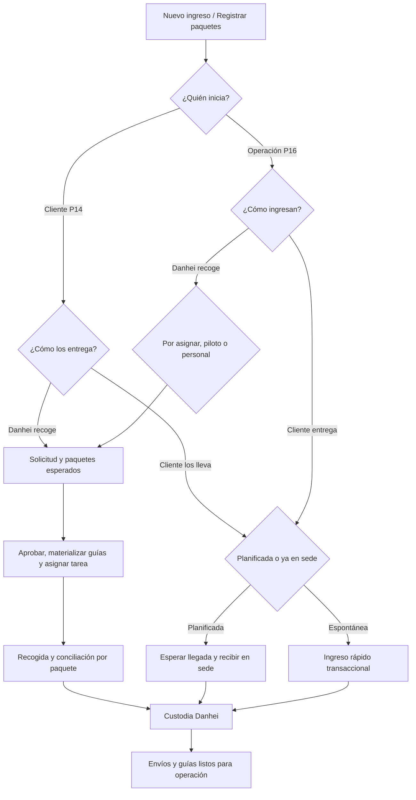

# Plan de unificación del ingreso de paquetes

**Fecha:** 15 de julio de 2026

**Estado:** propuesto; listo para aprobación e implementación

**Alcance:** navegación, creación de solicitudes, paquetes, guías, asignación, recepción y custodia en P14, P15 y P16

**Decisión principal:** todo paquete nuevo debe entrar por un único caso de uso de ingreso. La pantalla de pedidos conserva la consulta y gestión de guías, pero deja de ser una puerta paralela que omite recogida, recepción o custodia.

## 1. Problema comprobado

Actualmente existen dos caminos funcionales diferentes:

1. P14 y P16 crean una guía directamente mediante `POST /api/shipments`.
2. P14 y P16 crean una solicitud mediante `POST /api/pickup-intakes`, que genera paquetes esperados y una tarea de recogida o recepción.

Esto produce ambigüedad sobre el botón **Nuevo pedido** y permite crear guías sin explicar cómo llegó físicamente el paquete a Danhei.

| Superficie actual | Comportamiento | Riesgo |
|---|---|---|
| P16 `/pedidos` | modal “Nuevo pedido” → `/shipments` | omite solicitud, tarea, lote y custodia |
| Dashboard y paleta P16 | “Nuevo pedido” → `/pedidos?quickAction=new` | refuerza el camino incompleto |
| P16 `/recogidas/nueva` | crea solicitud con tres modalidades | camino operacional correcto, pero solo registra un primer paquete |
| P14 `/envios` | “Crear envío” → `/shipments` | duplica el ingreso y no usa idempotencia de solicitud |
| P14 `/recogidas` | crea solicitud para recogida o entrega planificada | compite con “Crear envío” |
| Recepción espontánea | crea solicitud y tarea, pero exige varias transiciones posteriores | demasiados pasos para una persona que ya está en mostrador |

También se comprobó que la materialización todavía registra descripciones con la palabra “WhatsApp”, aunque el caso de uso ya es multicanal. Ese texto debe independizarse del canal.

## 2. Conceptos que no se deben mezclar

| Concepto | Significado | Entidad actual |
|---|---|---|
| Solicitud de ingreso | intención de entregar uno o varios paquetes a Danhei | `pickup_requests` |
| Paquete esperado | unidad declarada antes o durante la recepción | `pickup_packages` |
| Tarea operativa | acción física de recoger o recibir | `operational_tasks` |
| Lote de recepción | conciliación física de paquetes recibidos, faltantes o rechazados | `pickup_batches` |
| Envío o guía | paquete aceptado para transporte y seguimiento | `shipments` |
| Pedido | término comercial ambiguo; no existe como entidad independiente | etiqueta de interfaz actual |

Regla: una solicitud puede agrupar muchos paquetes; cada paquete aceptado genera una sola guía; una tarea mueve o recibe esos paquetes; la custodia demuestra quién los tiene.

## 3. Las tres vías operativas

La sección visible debe llamarse **Ingreso de paquetes**. La ruta `/recogidas` puede mantenerse inicialmente para no romper enlaces, pero el nombre “Recogidas” por sí solo es incompleto porque el cliente también puede llevar el paquete.

### Vía A — Recogida con piloto

- Danhei recoge en la ubicación del cliente.
- La tarea se asigna a un piloto registrado.
- El piloto acepta, inicia, verifica cada paquete y registra el traspaso de custodia.
- P15 muestra la tarea y el resultado por paquete.

### Vía B — Recogida con personal Danhei

- Danhei recoge en la ubicación del cliente.
- La tarea se asigna a un empleado o recolector interno identificable.
- No se debe depender únicamente de nombre y teléfono escritos libremente.
- El empleado registra la recepción o entrega el lote a un operador de sede con trazabilidad.

### Vía C — El cliente envía o lleva los paquetes

Tiene dos variantes internas:

- **Entrega planificada:** el cliente avisa, selecciona sede y fecha estimada.
- **Ingreso espontáneo:** la persona ya está en la sede y no existe solicitud previa.

Ambas terminan en recepción de sede, conciliación física y custodia del operador.

Cuando el cliente envía a un tercero, mostrador registra quién entrega, teléfono, relación con el cliente y observaciones del traspaso. La custodia no se atribuye automáticamente al cliente presente si quien entrega es otra persona.

## 4. Dos ejes de datos

No se deben crear modalidades como `pickup_by_driver` y `pickup_by_employee`. El modelo profesional separa:

1. **Forma de ingreso**, ya soportada por `IntakeMode`:
   - `pickup_at_client_location`;
   - `planned_dropoff_at_hub`;
   - `walk_in_at_hub`.
2. **Ejecutor de la tarea**:
   - piloto Danhei;
   - empleado Danhei;
   - operador de sede;
   - recolector externo autorizado, si se habilita posteriormente.

Así una solicitud puede existir antes de decidir quién hará la recogida y puede reasignarse sin alterar su origen.

## 5. Ubicación definitiva del botón

### Acción global

El botón principal será **Nuevo ingreso** y abrirá un único asistente. Debe estar disponible en:

- dashboard de P16;
- encabezado de **Ingreso de paquetes**;
- encabezado de **Envíos y guías**;
- paleta de comandos;
- dashboard de P14 como **Registrar paquetes**.

Todos esos accesos deben llegar al mismo caso de uso. No deben abrir formularios distintos.

### Dentro de una solicitud

El botón será **Agregar paquete**. Añade una unidad a la solicitud existente mientras no haya sido conciliada o cancelada.

### En la lista de guías

La sección actual **Pedidos** se presentará como **Envíos y guías**. Su botón **Nuevo ingreso** redirigirá al asistente; no abrirá el modal directo de `/shipments`.

La creación directa de guía quedará como acción excepcional **Crear guía manual**, oculta para usuarios normales, con permiso específico, sede/custodio inicial, motivo obligatorio e auditoría. No se utilizará para la operación diaria.

## 6. Navegación propuesta

```text
Operaciones
├── Ingreso de paquetes
│   ├── Por asignar
│   ├── Piloto recoge
│   ├── Personal Danhei recoge
│   ├── Cliente entrega en sede
│   └── Historial y diferencias
├── Envíos y guías
├── Rutas
├── Control operativo
└── Novedades
```

La bandeja **Por asignar** es necesaria porque una solicitud de recogida puede crearse antes de saber si la ejecutará un piloto o un empleado.

## 7. Asistente único de creación

### P16

Paso 1 — **¿Cómo ingresarán los paquetes?**

- Danhei recoge en la ubicación del cliente.
- Cliente entrega en sede.

Si se elige recogida de Danhei, preguntar por separado quién ejecutará:

- por asignar;
- piloto;
- personal Danhei.

Si se elige cliente en sede, preguntar:

- “Avisó antes” → entrega planificada.
- “Ya está en mostrador” → ingreso espontáneo.

Paso 2 — **Cliente, contacto y origen**

- cliente;
- dirección de recogida o sede;
- contacto;
- persona que entregará en sede, cuando sea diferente del cliente;
- fecha/ventana;
- ejecutor o preferencia, si ya se conoce.

Paso 3 — **Paquetes**

- tabla editable de uno a cien paquetes;
- botón **Agregar paquete**;
- importación CSV posterior, no obligatoria para la primera entrega;
- destinatario, teléfono, dirección, zona, instrucciones, tipo, peso, fragilidad y referencia externa.

Paso 4 — **Valores**

- tipo de pago;
- COD por paquete;
- tarifa de envío;
- tarifa del piloto o concepto de recogida según permisos;
- totales de control.

Paso 5 — **Confirmación**

- resumen de vía, responsable, sede, cantidad y valores;
- llave idempotente;
- resultado con código de solicitud y siguientes acciones.

### P14

El cliente no debe escoger entre piloto y empleado; esa es una decisión interna de Danhei. P14 mostrará solo:

- **Danhei recoge en mi ubicación**;
- **Yo llevo o envío los paquetes a una sede**.

El botón actual **Crear envío** se reemplazará por **Registrar paquetes** y utilizará `pickup-intakes`. La página **Mis envíos** seguirá mostrando las guías materializadas y su seguimiento.

## 8. Momento de creación de la guía

| Vía | Momento recomendado |
|---|---|
| Piloto recoge | al aprobar la solicitud y antes de asignar la tarea, como guía programada |
| Personal Danhei recoge | al aprobar la solicitud y antes de asignar la tarea, como guía programada |
| Entrega planificada | al confirmar la solicitud; se activa la custodia al recibir físicamente |
| Ingreso espontáneo | dentro de la misma transacción en que mostrador recibe y acepta el paquete |

Una guía programada que resulte faltante o rechazada no se elimina: queda con causal operativa y sin causación de servicio completado.

## 9. Flujo objetivo



## 10. Cambios de backend

### Obligatorios

1. Crear un caso de uso común `CreateIntake` para P14 y P16 sobre la lógica actual de `CreatePickupRequest`.
2. Crear `POST /pickup-requests/{pickupRequest}/packages` con idempotencia y bloqueo de estado.
3. Extraer `MaterializeShipmentFromPickupPackage` para garantizar una sola guía por paquete.
4. Reconsultar y bloquear cada paquete dentro de la transacción de materialización; un reintento concurrente no puede crear una segunda guía ni dejar una guía huérfana.
5. Automatizar materialización al aprobar según la tabla anterior.
6. Crear un comando transaccional de ingreso espontáneo que:
   - cree solicitud;
   - cree paquetes;
   - asigne la tarea al operador autenticado;
   - abra y concilie el lote;
   - materialice solo paquetes aceptados;
   - registre identidad del entregante, custodia y auditoría.
7. Añadir asignación interna mediante `assigned_user_id` y tipo `danhei_employee`; conservar nombre/teléfono como instantánea, no como identidad principal.
8. Separar el permiso general `shipments.create` de un permiso excepcional `shipments.direct_create`.
9. Reemplazar mensajes internos “desde recogida WhatsApp” por “desde solicitud de ingreso” y registrar el canal en un campo separado.
10. Aplicar `Idempotency-Key` a creación, adición de paquetes, materialización e ingreso espontáneo.

### Reglas de estado

- no agregar paquetes después de cerrar el lote, cancelar la solicitud o iniciar despacho;
- no materializar dos veces el mismo `pickup_package`;
- permitir reasignar o reprogramar antes de iniciar la tarea, conservando el historial;
- cancelar mediante transición y causal, nunca eliminando la solicitud;
- no causar tarifa de recogida hasta completar o completar parcialmente la tarea;
- no causar entrega hasta que la guía se entregue;
- faltantes y rechazados conservan motivo, evidencia y auditoría;
- paquetes adicionales encontrados en sede deben agregarse antes de cerrar la conciliación.

## 11. Cambios de frontend

### P16

- cambiar el nombre visible **Recogidas** por **Ingreso de paquetes**;
- cambiar **Pedidos** por **Envíos y guías** sin romper inicialmente la ruta `/pedidos`;
- reemplazar dashboard, paleta y encabezados para usar **Nuevo ingreso**;
- retirar el modal directo de creación de la operación normal;
- convertir `/recogidas/nueva` en el asistente único;
- agregar editor multi-paquete y reutilizar la validación avanzada de dirección que hoy vive en `/pedidos`;
- presentar las tres vías, la cola por asignar y los resultados por paquete;
- optimizar ingreso espontáneo para mostrador, sin obligar al operador a recorrer manualmente estados intermedios.

### P14

- reemplazar **Nuevo envío** por **Registrar paquetes**;
- retirar el POST directo a `/shipments`;
- fusionar la información de los formularios actuales de Envíos y Recogidas;
- mantener **Mis envíos** como historial de guías;
- mostrar al cliente estado de solicitud, cantidad esperada/recibida y guías resultantes.

### P15

- mantener la tarea de recogida para piloto;
- mostrar código de solicitud, cantidad y guías;
- permitir resultado por paquete;
- no mostrar tareas asignadas a empleados o mostrador;
- sincronizar diferencias y custodia sin duplicar acciones al reintentar.

## 12. Permisos y responsabilidades

| Actor | Crear solicitud | Elegir ejecutor | Recoger | Recibir en sede | Crear guía directa |
|---|---:|---:|---:|---:|---:|
| Cliente P14 | solo para su cliente | no | no | no | no |
| Operador de mostrador | sí | no | no | sí | no |
| Coordinador operativo | sí | sí | no | sí | solo excepción autorizada |
| Piloto | no | no | tareas propias | entrega de lote asignado | no |
| Empleado recolector | no | no | tareas propias | entrega de lote asignado | no |
| Administrador | sí | sí | según rol | sí | con permiso, motivo y auditoría |

## 13. Fases de implementación

### Fase 0 — Aprobación funcional

- aprobar nombres: **Ingreso de paquetes**, **Envíos y guías**, **Nuevo ingreso** y **Agregar paquete**;
- confirmar si habrá recolectores externos además de empleados;
- aprobar cuándo se imprime la guía y la etiqueta.

### Fase 1 — Integridad de dominio y API

- [x] caso de uso común;
- [x] identidad del empleado;
- [x] adición de paquetes;
- [x] materialización única con bloqueo de concurrencia;
- [x] ingreso espontáneo transaccional;
- [x] permisos, idempotencia, auditoría y pruebas focalizadas;
- [ ] automatizar la materialización al aprobar cuando FIN-01 defina las tarifas predeterminadas;
- [ ] publicar las migraciones y aprobar UAT.

**Estado del 15 de julio:** implementación local completada en P16 API. La regresión focalizada pasa con 26 pruebas y 150 aserciones y la suite completa con 348 pruebas y 1.616 aserciones. Esta marca no declara despliegue ni cierra OPS-00: P14, el corte del permiso directo y UAT siguen pendientes.

Las guías históricas sin `pickup_package` se clasificarán como origen legado directo. No se crearán solicitudes, tareas ni eventos de custodia retroactivos sin evidencia. Permanecerán consultables y el informe de integridad mostrará cuántas existen.

### Fase 2 — P16

- [x] asistente único con las tres vías y múltiples paquetes;
- [x] navegación, paleta, tablero y CTAs normales migrados a **Nuevo ingreso**;
- [x] bandeja filtrable por vía, asignación a piloto, empleado o recolector autorizado;
- [x] ingreso espontáneo conectado a la operación atómica de mostrador;
- [x] recepción programada con usuario autenticado e identidad del tercero;
- [x] adición idempotente y materialización selectiva desde el detalle;
- [x] creación directa retirada del recorrido normal de P16 y conservada solo como compatibilidad interna temporal;
- [ ] QA visual funcional en escritorio y móvil.

**Estado del 15 de julio:** implementación y controles automáticos completados en local: lint, TypeScript y build aprobados. El responsable funcional realizará la revisión visual antes de autorizar publicación.

### Fase 3 — P14

- unificar Crear envío y Solicitar recogida;
- migrar CTAs;
- mostrar solicitudes y guías resultantes.

### Fase 4 — P15 y QA integral

- validar tareas del piloto;
- probar conciliación física y reintentos;
- ejecutar UAT P14 → P16 → P15;
- deshabilitar creación directa para roles normales.

## 14. Casos de aceptación

1. Un administrador crea recogida con piloto para diez paquetes: existe una solicitud, diez paquetes, diez guías como máximo y una tarea asignada.
2. La misma recogida asignada a empleado conserva el origen y cambia únicamente el ejecutor.
3. Un cliente programa entrega en sede y mostrador recibe ocho de diez paquetes: quedan ocho recibidos y dos faltantes con causal.
4. Una persona llega sin aviso: mostrador registra y recibe el paquete en una operación, con guía y custodia, sin ruta ficticia.
5. Un paquete adicional se agrega antes de cerrar el lote y genera exactamente una guía.
6. Un doble clic o reintento no duplica solicitud, paquete, tarea, lote ni guía.
7. Ningún CTA normal de P14 o P16 crea una guía omitiendo el ingreso.
8. El cliente no puede escoger ni ver datos internos del empleado o piloto antes de la asignación autorizada.
9. Un paquete faltante o rechazado no causa automáticamente una recogida completa ni pago total.
10. **Envíos y guías** muestra todas las guías materializadas sin importar la vía de ingreso.
11. Si un tercero lleva el paquete, el lote conserva quién entregó y el evento de custodia refleja el traspaso real.

## 15. Métricas de control

- solicitudes creadas por canal y vía;
- tiempo desde solicitud hasta asignación;
- tiempo de recepción en mostrador;
- paquetes esperados, recibidos, faltantes y rechazados;
- guías directas excepcionales;
- duplicados evitados por idempotencia;
- solicitudes sin tarea o paquetes sin guía después del punto esperado;
- diferencias de custodia abiertas.

## 16. Riesgos y mitigaciones

| Riesgo | Mitigación |
|---|---|
| Romper enlaces actuales | mantener redirects de `/recogidas` y `/pedidos` |
| Perder campos avanzados del formulario de pedidos | extraer y reutilizar el editor de paquete/dirección |
| Crear guías huérfanas | materializar únicamente desde `pickup_package` salvo permiso excepcional |
| Inventar historia para guías anteriores | clasificarlas como legado directo sin fabricar custodia retroactiva |
| Empleados identificados solo por texto | `assigned_user_id` y auditoría |
| Mostrador demasiado lento | comando de ingreso espontáneo en una transacción |
| Doble creación desde P14 | idempotencia y retiro de POST directo |
| Impacto financiero prematuro | causar solo por eventos físicos completados |

## 17. Fuera de alcance

- activación productiva de WhatsApp;
- QR Nequi productivo;
- optimización automática de rutas;
- importación masiva avanzada, salvo que se priorice después del flujo manual estable.

## 18. Definición de terminado

Este bloque estará terminado cuando:

- exista una sola entrada normal para paquetes nuevos;
- las tres vías sean claras en P16 y las dos decisiones del cliente sean claras en P14;
- ningún rol normal pueda omitir recepción y custodia;
- mostrador pueda registrar un ingreso espontáneo de forma rápida;
- cada paquete aceptado produzca una sola guía;
- permisos, idempotencia, auditoría, pruebas y UAT estén aprobados;
- README, contratos, arquitectura, roadmap y manuales de QA estén actualizados.
