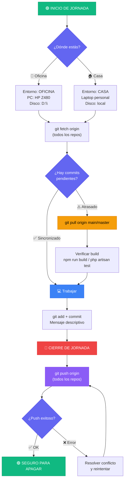
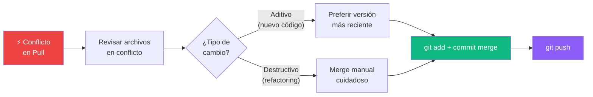

# 🔄 Protocolo de Sincronización Casa ↔ Oficina


---

## Flujo Operativo



---

## Repositorios Gestionados

| Prioridad | Proyecto | Ruta | Rama | Remote |
|-----------|----------|------|------|--------|
| 🔴 ALTA | **P16-DHE-Admin-Web** | `d:\DHE dev\P16-DHE-Admin-Web` | `main` | github/gallegosdiego |
| 🟡 MEDIA | TranscriptorIA / NODA | `d:\Proyectos\TranscriptorIA` | `master` | github/gallegosdiego |

---

## Scripts Automatizados

````carousel
### 🟢 sync-inicio.ps1 — Inicio de Jornada
```
Ubicación: d:\DHE dev\sync-inicio.ps1
```

**Ejecutar al llegar a trabajar (casa u oficina):**

```powershell
cd "d:\DHE dev"
.\sync-inicio.ps1
```

**Lo que hace automáticamente:**
1. Pregunta: *¿Dónde estás? (Oficina / Casa)*
2. Ejecuta `git fetch` en todos los repos
3. Detecta commits pendientes (ahead/behind)
4. Muestra archivos dirty y stash pendientes
5. Ofrece hacer `git pull` automático
6. Genera log en `d:\DHE dev\.sync-logs\`

<!-- slide -->

### 🔴 sync-cierre.ps1 — Cierre de Jornada
```
Ubicación: d:\DHE dev\sync-cierre.ps1
```

**Ejecutar antes de apagar/irse:**

```powershell
cd "d:\DHE dev"
.\sync-cierre.ps1
```

**Lo que hace automáticamente:**
1. Detecta archivos sin commit en cada repo
2. Ofrece: Commit+Push / Stash / Ignorar
3. Verifica commits sin push
4. Ejecuta `git push` automático
5. Validación final: TODO PUSHED
6. Genera log en `d:\DHE dev\.sync-logs\`
````

---

## Reglas Fundamentales

> [!IMPORTANT]
> **GitHub es la ÚNICA fuente de verdad.** Nunca depender de USB para sincronizar código.

> [!WARNING]
> **PUSH antes de salir.** Nunca cerrar la laptop/PC sin hacer push. Es la causa #1 de desincronización.

> [!TIP]
> **PULL al llegar.** Siempre ejecutar `sync-inicio.ps1` antes de escribir la primera línea de código del día.

> [!NOTE]
> **USB es complementario.** Solo usar para assets pesados (videos, modelos ML, datasets) o documentación PDF. El código SIEMPRE va por Git.

---

## Checklist Rápido

### Inicio de Jornada ☀️
- [ ] Ejecutar `sync-inicio.ps1`
- [ ] Revisar reporte de estado
- [ ] Pull si hay commits pendientes
- [ ] Verificar que el proyecto compila
- [ ] Comenzar a trabajar

### Cierre de Jornada 🌙
- [ ] Guardar todo el trabajo
- [ ] Commit con mensaje descriptivo
- [ ] Ejecutar `sync-cierre.ps1`
- [ ] Verificar que todo está pushed
- [ ] Cerrar sesión

---

## Manejo de Conflictos



> [!CAUTION]
> **NUNCA resolver conflictos con `--force` o `reset` sin entender el cambio.** Si se olvidó push la noche anterior, conectarse remotamente a la otra máquina y hacer push desde ahí primero.
